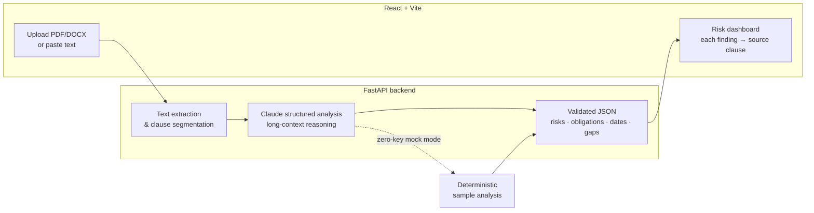

# Clause Lens — AI Contract Analyzer

> Upload a contract, get back a plain-English summary, risk flags with severity, obligations, key dates, and missing-clause warnings — every finding traced back to the exact clause it came from.

Clause Lens turns dense legal PDFs into a structured risk dashboard. It is built on **Anthropic Claude's** long-context reasoning and structured-output capabilities, so it can read a full agreement end-to-end, reason about how clauses interact, and return machine-verifiable JSON that the UI renders as an interactive report. Every risk, obligation, and date links to the source clause, so nothing is a black box.

It also ships with a **zero-key mock mode**: run the whole product locally with no Anthropic API key and get realistic, deterministic sample analyses. Perfect for demos, CI, and evaluating the UX before wiring in a real key.

---

## Why this matters / who it's for

Reviewing contracts by hand is slow, expensive, and error-prone — the risky clause is usually the one nobody re-read at 11pm. Clause Lens is for:

- **Founders and operators** who sign vendor, SaaS, and partnership agreements without a lawyer on staff and want a fast first-pass triage.
- **Legal and procurement teams** who need to screen a high volume of contracts and surface the ones that deserve human attention.
- **Freelancers and agencies** reviewing client MSAs, SOWs, and NDAs before committing.

Clause Lens does not replace a lawyer. It gives you a fast, traceable first read so you know *where to look* and *what to ask about* — with each finding anchored to the exact clause so you can verify it in seconds.

---

## Features

- **Plain-English summary** — the whole agreement distilled into a few readable paragraphs.
- **Risk flags with severity** — each risk labeled `low` / `medium` / `high` / `critical`, with an explanation of *why* it matters.
- **Obligations extraction** — who must do what, by when, for both parties.
- **Key dates & deadlines** — renewal windows, termination notice periods, payment due dates, expiry.
- **Missing-clause warnings** — flags clauses a contract of this type usually contains but this one omits (e.g. limitation of liability, governing law, confidentiality).
- **Clause-level traceability** — every finding cites the exact clause text and location, so you can jump straight to the source.
- **Structured JSON output** — Claude returns a validated schema, not free text, so the frontend renders it reliably.
- **Zero-key mock mode** — full end-to-end experience with no API key and no network calls.
- **Upload or paste** — drop in a PDF/DOCX/TXT or paste raw contract text.

---

## Architecture



**Flow:** a contract is uploaded or pasted → the backend extracts and segments the text into clauses → Claude analyzes the full document with long-context reasoning and returns a structured JSON schema → the response is validated → the frontend renders it as a risk dashboard where every finding links back to the exact clause.

---

## Tech Stack

| Layer        | Technology                                                        |
| ------------ | ----------------------------------------------------------------- |
| Frontend     | React 18, TypeScript (strict), Vite, Tailwind CSS                 |
| Backend      | Python 3.11, FastAPI, Uvicorn, Pydantic v2                        |
| AI           | Anthropic Claude (`claude-opus-4-8`) via the official `anthropic` SDK, with structured outputs |
| Extraction   | `pypdf` / `python-docx` for text extraction                       |
| Tooling      | Docker + Docker Compose, Makefile                                 |

---

## Quickstart

### Option A — Docker (recommended)

Requires Docker and Docker Compose.

```bash
# 1. Clone
git clone https://github.com/eman-munir/clause-lens-contract-analyzer.git
cd clause-lens-contract-analyzer

# 2. (Optional) add your Anthropic key — omit this to run in mock mode
cp backend/.env.example backend/.env
# then edit backend/.env and set ANTHROPIC_API_KEY=sk-ant-...

# 3. Build and run both services
make docker-up
# or: docker compose up --build
```

- Frontend: http://localhost:5173
- Backend API + docs: http://localhost:8000/docs

Without an API key, the backend automatically serves deterministic mock analyses — the whole app works with zero configuration.

### Option B — Local development

Run the backend and frontend in two terminals.

**1. Backend**

```bash
cd backend
python -m venv .venv
source .venv/bin/activate          # Windows: .venv\Scripts\activate
pip install -r requirements.txt

cp .env.example .env               # optional: add your key (see below)
uvicorn app.main:app --reload --port 8000
```

The API is now at http://localhost:8000 (interactive docs at `/docs`).

**2. Frontend**

```bash
cd frontend
npm install
npm run dev
```

The app is now at http://localhost:5173 and talks to the backend via `VITE_API_URL`.

---

## Adding your Anthropic API key (never commit it)

Clause Lens reads the key **only** from an environment variable / a gitignored `.env` file. It is never hardcoded.

1. Get a key from the [Anthropic Console](https://console.anthropic.com/).
2. Copy the example file and add your key:

   ```bash
   cp backend/.env.example backend/.env
   ```

   ```dotenv
   # backend/.env
   ANTHROPIC_API_KEY=sk-ant-your-key-here
   ```

3. Restart the backend (or `make docker-up` again).

> `.env` is gitignored — see [`.gitignore`](./.gitignore). **Never commit a real key.** If you omit the key entirely, Clause Lens runs in **mock mode** with no external calls, which is ideal for demos and CI.

To pass the key through Docker Compose without a file, export it in your shell before `docker compose up` — see the comment in [`docker-compose.yml`](./docker-compose.yml).

---

## API Reference

Base URL: `http://localhost:8000`

| Method | Endpoint          | Description                                                                 |
| ------ | ----------------- | --------------------------------------------------------------------------- |
| `GET`  | `/api/health`     | Liveness check. Returns `status` and the active `provider` (`anthropic` or `mock`). |
| `POST` | `/api/analyze`    | Analyze a contract. Send either JSON (`{ "text": "..." }`) or `multipart/form-data` with a `file` field (PDF/DOCX/TXT/MD). Returns the full structured analysis. |

**Example — analyze pasted text:**

```bash
curl -X POST http://localhost:8000/api/analyze \
  -H "Content-Type: application/json" \
  -d '{"text": "This Master Services Agreement is entered into..."}'
```

**Example — analyze an uploaded file:**

```bash
curl -X POST http://localhost:8000/api/analyze \
  -F "file=@contract.pdf"
```

**Example response shape (abridged).** Fields are camelCase on the wire:

```json
{
  "documentType": "Master Services Agreement",
  "summary": "A one-year Master Services Agreement that auto-renews...",
  "mock": false,
  "parties": [{ "name": "Acme Corp.", "role": "Service Provider" }],
  "keyDates": [
    { "label": "Renewal notice deadline", "date": "2026-11-01", "note": "60 days before term end (Section 8.2)." }
  ],
  "obligations": [
    { "party": "Client", "obligation": "Pay invoices within 30 days", "clauseReference": "Section 4.1" }
  ],
  "risks": [
    {
      "id": "risk-1",
      "title": "Automatic renewal with short opt-out window",
      "severity": "high",
      "clauseReference": "Section 8.2",
      "explanation": "Renews for successive 1-year terms unless cancelled 60 days prior.",
      "recommendation": "Add a calendar reminder 90 days before each term end."
    }
  ],
  "missingClauses": [
    { "clause": "Limitation of Liability", "whyItMatters": "Caps exposure if something goes wrong." }
  ]
}
```

> The interactive OpenAPI docs at `/docs` are the source of truth for the exact request/response schemas.

---

## How it works

1. **Ingestion** — the contract arrives as an upload (PDF/DOCX/TXT) or pasted text. Uploaded files are parsed to plain text with `pypdf` / `python-docx`.
2. **Segmentation** — the text is normalized and segmented into clauses so findings can reference exact locations.
3. **Structured analysis** — the full document is sent to Claude with a strict output schema. Claude's long context lets it reason about the whole agreement at once — how clauses interact, what's missing, which obligations are one-sided — and it returns validated JSON rather than prose.
4. **Validation** — the response is parsed against Pydantic models. Malformed output is rejected rather than rendered.
5. **Rendering** — the frontend turns the JSON into a risk dashboard: severity-sorted risk flags, obligations by party, a dated timeline, and missing-clause warnings — each linking back to its source clause.

In **mock mode** (no API key), step 3 is replaced by a deterministic local fixture, so the rest of the pipeline behaves identically.

---

## Screenshots

> _Drop real screenshots into `docs/screenshots/` and update the links below._

| Upload & paste | Risk dashboard |
| -------------- | -------------- |
| _`docs/screenshots/upload.png`_ | _`docs/screenshots/dashboard.png`_ |

| Clause traceability | Missing-clause warnings |
| ------------------- | ----------------------- |
| _`docs/screenshots/traceability.png`_ | _`docs/screenshots/missing-clauses.png`_ |

---

## Roadmap

- [ ] Side-by-side clause comparison across two contract versions (redline view)
- [ ] Exportable PDF report of the analysis
- [ ] Contract-type templates (NDA, MSA, SOW, employment) with type-specific missing-clause checks
- [ ] Citations that highlight the exact character span in the source document
- [ ] Multi-document portfolio view with aggregate risk scoring
- [ ] Optional human-in-the-loop review workflow and comments

---

## Disclaimer

Clause Lens is an AI-assisted analysis tool, **not legal advice**. Always have a qualified attorney review contracts before signing.

## License

Released under the [MIT License](./LICENSE) — © 2026 Eman Munir.
